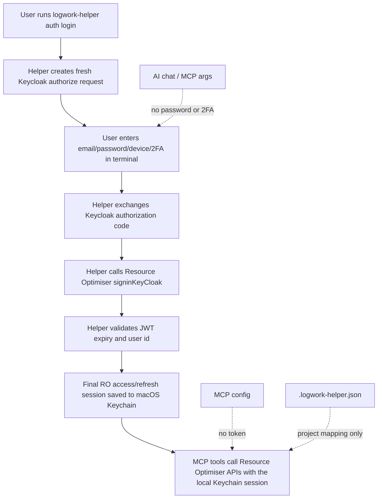

# Logwork Helper

[](https://www.npmjs.com/package/logwork-helper)
[](https://www.npmjs.com/package/logwork-helper)

Local MCP server for AI assistants to query, preview, and submit Resource Optimiser logwork.

Logwork Helper is designed for Cursor, Codex, Google Antigravity, GitHub Copilot / VS Code, and other MCP clients. It runs locally over `stdio`, authenticates through Resource Optimiser / Keycloak APIs, and stores only local project matching hints.

## Quick Start

1. Install the helper:

```bash
npx -y logwork-helper setup-user
```

The installer prints a checklist with install status, next steps, MCP config snippets, verification prompt, and safety reminders.

2. Authenticate Resource Optimiser if setup did not complete auth for you:

```bash
logwork-helper auth login
```

3. Follow the terminal prompts for email, password, 2FA device, and 2FA code.
4. Paste one MCP config printed by the installer into your IDE.
5. Restart or reload your IDE MCP tools.
6. Verify from your AI assistant:

```text
Check my logwork for this week.
```

## Requirements

- macOS
- Node.js 20+
- npm, or yarn if you prefer `yarn dlx`

## Environment Configuration

Defaults target the current Resource Optimiser / Vinova profile. For non-default deployments, configure the runtime with environment variables instead of editing source:

```bash
LOGWORK_HELPER_PROFILE=vinova
LOGWORK_API_BASE=https://api.resourceoptimiser.com/api/v1
LOGWORK_LOGIN_URL=https://app.resourceoptimiser.com/vinova
LOGWORK_KEYCLOAK_AUTH_URL=https://keycloak.vinova.sg/auth/realms/resource/protocol/openid-connect/auth
LOGWORK_KEYCLOAK_TOKEN_URL=https://keycloak.vinova.sg/auth/realms/resource/protocol/openid-connect/token
LOGWORK_KEYCLOAK_REDIRECT_URI=https://app.resourceoptimiser.com/vinova/check-login
```

Supported overrides: `LOGWORK_HELPER_PROFILE`, `LOGWORK_API_BASE`, `LOGWORK_LOGIN_URL`, `LOGWORK_TOKEN_KEY`, `LOGWORK_ALLOWED_SAFARI_HOSTS`, `LOGWORK_KEYCLOAK_AUTH_URL`, `LOGWORK_KEYCLOAK_TOKEN_URL`, `LOGWORK_KEYCLOAK_CLIENT_ID`, `LOGWORK_KEYCLOAK_REDIRECT_URI`, `LOGWORK_KEYCLOAK_SCOPE`, `LOGWORK_KEYCLOAK_RESPONSE_MODE`, `LOGWORK_KEYCLOAK_RESPONSE_TYPE`, `LOGWORK_HTTP_TIMEOUT_MS`, `LOGWORK_HTTP_READ_RETRIES`, `LOGWORK_HTTP_RETRY_DELAY_MS`, and `LOGWORK_DAY_LOG_CONCURRENCY`.

URL and numeric overrides are validated on startup. Invalid values fail fast so the helper does not log work against an unintended endpoint.

## Install

Recommended one-time install:

```bash
npx -y logwork-helper setup-user
```

Equivalent options:

```bash
npm install -g logwork-helper
logwork-helper setup-user
```

```bash
yarn dlx logwork-helper setup-user
```

```bash
yarn global add logwork-helper
logwork-helper setup-user
```

The installer copies the runtime into `~/.logwork-helper`, installs production dependencies, links the `logwork` and `logwork-helper` terminal commands with `npm link`, then prints a ready-to-follow onboarding checklist using your actual macOS path.

To install and start auth immediately:

```bash
npx -y logwork-helper setup-user --login
```

Use `--no-login` when installing in scripts or CI.

## Auth Setup

Logwork Helper does not accept or store Bearer tokens in config files. Login is API-only: the helper creates a fresh Keycloak OIDC authorize session, asks for email/password/device/2FA in the terminal, exchanges the authorization code, calls Resource Optimiser `signinKeyCloak`, and stores only the final Resource Optimiser access/refresh token session in macOS Keychain.

Start login:

```bash
logwork-helper auth login
```

What happens:

1. The helper creates a fresh Keycloak authorization request.
2. You enter Resource Optimiser email and password in the terminal.
3. You choose the 2FA device in the terminal.
4. You enter the 2FA code in the terminal.
5. The helper exchanges the Keycloak authorization code.
6. The helper calls Resource Optimiser `signinKeyCloak`.
7. The helper stores the Resource Optimiser access/refresh token session in macOS Keychain.

Check auth status without printing the token:

```bash
logwork-helper auth status
```

Delete the stored token:

```bash
logwork-helper auth logout
```

Auth notes:

- Password and 2FA are never accepted through MCP tool inputs or AI chat.
- Password and 2FA are never stored.
- Keycloak URLs contain dynamic `state`, `nonce`, `execution`, and `tab_id` values. Do not hardcode or paste them into config.
- Keycloak access tokens are intermediate only and are not stored.
- Only the final Resource Optimiser access/refresh token session is stored in macOS Keychain.

### Auth Security Flow




## MCP Setup

Use one exact config block printed by `logwork-helper setup-user` when possible. The examples below use `/Users/<user>` as a placeholder; your installer output will contain the resolved `~/.logwork-helper/mcp-server.mjs` path.

### Cursor

Add this to Cursor MCP settings:

```json
{
  "mcpServers": {
    "logwork-helper": {
      "command": "node",
      "args": ["/Users/<user>/.logwork-helper/mcp-server.mjs"]
    }
  }
}
```

### Codex

Add this to `~/.codex/config.toml`, or to project `.codex/config.toml`:

```toml
[mcp_servers.logwork-helper]
command = "node"
args = ["/Users/<user>/.logwork-helper/mcp-server.mjs"]
startup_timeout_sec = 20
tool_timeout_sec = 120
```

### Google Antigravity

Add this to `~/.gemini/antigravity/mcp_config.json`:

```json
{
  "mcpServers": {
    "logwork-helper": {
      "command": "node",
      "args": ["/Users/<user>/.logwork-helper/mcp-server.mjs"]
    }
  }
}
```

### GitHub Copilot / VS Code

Add this to workspace `.vscode/mcp.json` or your VS Code user MCP config:

```json
{
  "servers": {
    "logworkHelper": {
      "type": "stdio",
      "command": "node",
      "args": ["/Users/<user>/.logwork-helper/mcp-server.mjs"]
    }
  }
}
```

### Claude Code

Add the server from Terminal:

```bash
claude mcp add --transport stdio logwork-helper -- node "/Users/<user>/.logwork-helper/mcp-server.mjs"
```

Or add this to project `.mcp.json`:

```json
{
  "mcpServers": {
    "logwork-helper": {
      "command": "node",
      "args": ["/Users/<user>/.logwork-helper/mcp-server.mjs"]
    }
  }
}
```

After editing config, restart/reload the IDE. The MCP server should expose:

- `query_logwork`
- `preview_logwork_batch`
- `apply_logwork_batch`
- `list_logwork_projects`
- `upsert_project_mapping`
- `start_auth_login`

If an MCP tool says auth is required, ask your assistant to call `start_auth_login` or run `logwork-helper auth login` yourself in Terminal. Do not paste passwords or 2FA codes into AI chat.

Templates are also available in `examples/mcp/`.

Verify setup with:

```text
Check my logwork for this week.
```

## Verify With AI Prompts

Use these prompts after your IDE sees `logwork-helper`:

```text
Check my logwork for this week.
```

```text
Which Resource Optimiser project should this repo log work to?
```

```text
Preview this logwork and ask for my approval before submitting:
Monday, 01 Jun 2026
+2 Maintenance mode management and status UI (SCB-213)
```

```text
Set up the SCB ticket mapping to project 2621A-SIT-HTML BUILDER-PRJ.
```

## Common Workflows

### Query Logwork

Ask your assistant:

```text
Check whether I have logged anything today.
```

```text
List the days and projects I logged work for this week, including task details.
```

The assistant should call `query_logwork`. This is read-only and does not need confirmation.

### Preview Then Apply

Use weekly text like this:

```text
Monday, 01 Jun 2026
+2 Maintenance mode management and status UI (SCB-213, SCB-227)
+1 System page updates
Tuesday, 02 Jun 2026
+2.5 Password reset validation and UI improvements (SCB-228)
```

Expected flow:

1. Assistant calls `preview_logwork_batch`.
2. Assistant shows the summary, including the approval checklist with total hours, date range, and project breakdown, then asks for approval.
3. Assistant calls `apply_logwork_batch` with the returned `batchId` only after you approve.

`apply_logwork_batch` requires `confirm: true` and a cached `batchId` from the preview step. If the preview expired or changed, rerun `preview_logwork_batch` before applying.

### Setup Project Mapping

You do not need to create `.logwork-helper.json` manually.

If preview cannot resolve a ticket like `SCB-213`, ask your assistant to list projects or choose the correct project. The assistant can call:

- `list_logwork_projects` to fetch your Resource Optimiser project memberships.
- `upsert_project_mapping` to save ticket/keyword mapping after approval.

Default mapping storage:

```text
~/.logwork-helper/.logwork-helper.json
```

Example mapping created by MCP:

```json
{
  "projectMappings": [
    {
      "projectName": "2621A-SIT-HTML BUILDER-PRJ",
      "projectMemberId": 5234,
      "tickets": ["SCB"],
      "keywords": ["question bank", "programme", "cluster"]
    }
  ]
}
```

This file stores matching hints only. It never stores Resource Optimiser tokens.

### Allow Unbooked Logging

If a task matches one of your Resource Optimiser project memberships but is not booked for that date, preview marks it as `UNBOOKED`.

Only allow this when the matched project is correct. Applying unbooked entries requires both:

```json
{
  "confirm": true,
  "allowUnbooked": true
}
```

## Stored Files And Security

Installed runtime:

```text
~/.logwork-helper
```

Project mapping config:

```text
~/.logwork-helper/.logwork-helper.json
```

Security model:

- Password and 2FA are entered in the terminal, not in MCP tool inputs or AI chat.
- Password and 2FA are never stored.
- Email may be remembered in macOS Keychain to prefill the next login.
- Keycloak access tokens are intermediate only and are not stored.
- The final Resource Optimiser access/refresh token session is stored in macOS Keychain.
- Token is not stored in MCP config.
- Token is not stored in `.logwork-helper.json`.
- Auth does not open or read any browser profile.
- MCP writes logwork only after an assistant calls `apply_logwork_batch` with explicit confirmation and a cached preview `batchId`.
- `query_logwork` and `list_logwork_projects` are read-only.

## Update

For `npx` users:

```bash
npx -y logwork-helper setup-user
```

For global npm users:

```bash
npm update -g logwork-helper
logwork-helper setup-user
```

Restart/reload your IDE after updating.

## Manual Terminal REPL

If you want to log work directly from Terminal without an MCP client, use the deterministic React + Ink manual session:

```bash
logwork
```

If you have not installed the package globally, run the same REPL one-off with:

```bash
npx -p logwork-helper logwork
```

Compatibility commands still work:

```bash
logwork-helper manual
logwork-helper log
```

Prompt preview:

```text
╭─ Logwork Helper ─────────────────────────────╮
│ cwd: /path/to/repo                           │
╰──────────────────────────────────────────────╯

logwork › /
╭──────────────────────────────────────────────╮
│ › /query      Query logwork by day or range  │
│   /logwork    Create logwork wizard          │
│   /projects   List projects with weekly chart│
╰──────────────────────────────────────────────╯
```

Useful commands inside the session:

```text
/query today
/query this-week
/logwork
/mcp
/projects
/projects 5234
/map SCB 5234
/diagnostics
```

Use `/mcp` to choose Cursor, Antigravity, GitHub Copilot / VS Code, Claude Code, or Codex and print copy-ready MCP setup for that client. You can also jump directly with `/mcp cursor`, `/mcp antigravity`, `/mcp copilot`, `/mcp claude-code`, or `/mcp codex`.

`/logwork` opens a guided flow: pick a day in the current week, pick a Resource Optimiser project, then enter one task per line:

```text
+2 check ui/ux
+1.5 polish reset password state

```

Inside `/logwork`, press Enter on an empty input to apply the ready preview. Use `/remove` to open a multi-select task remover, `/edit` to replace a task, `/save` to persist a local draft, or `Esc` to cancel with confirmation. The panel shows only the current command/session so the draft preview stays readable.

While the `task ›` prompt is active, type `/` to see task-only actions with descriptions:

```text
/save     Save this draft locally
/drafts   Resume or delete saved drafts
/diagnostics Write a sanitized support report
/remove   Select tasks to delete
/edit     Select one task and replace it
/clear    Clear current task list
/back     Return to project picker
/cancel   Discard this logwork session
```

Press `Esc` in the task editor to cancel the current logwork session; if tasks exist, the CLI asks for confirmation first. Drafts saved with `/save` are stored locally at `~/.logwork-helper/manual-drafts.json` and never contain tokens, passwords, or OTPs. Running `/logwork` again detects saved drafts so you can resume or delete them before starting a new session.

Press `Esc` from the main prompt to exit the manual CLI.

The manual REPL uses the same safety model as MCP: preview first, explicit confirmation before submit, extra confirmation for unbooked entries, and API-only Resource Optimiser auth in Terminal. `/projects` shows this-week booked/logged charts per project so you can quickly see booked capacity, logged hours, and overbooked work.

## Release Checks

Before publishing or tagging a release, run:

```bash
npm run release:check
```

This runs tests, production dependency audit, package dry run, and whitespace checks. See [RELEASE.md](RELEASE.md) for the full checklist and manual verification steps.

## Troubleshooting

- **IDE does not show tools**: restart/reload the MCP client and check the server path points to `~/.logwork-helper/mcp-server.mjs`.
- **`logwork: command not found` after `setup-user`**: open a new terminal first. If it still fails, run `npm install -g logwork-helper` or ensure your npm global bin directory is on `PATH`.
- **`npm error ELINKGLOBAL` during `setup-user`**: update to `logwork-helper@0.1.6` or newer, then rerun `npx -y logwork-helper setup-user`. The installer uses `npm link`, not `npm link --global`.
- **`query_logwork` or `allowUnbooked` missing**: reload the MCP tool cache or restart the IDE.
- **Not authenticated**: run `logwork-helper auth login`, or ask the assistant to call `start_auth_login`; enter secrets only in Terminal.
- **Auth error after 2FA**: retry `logwork-helper auth login`. If it still fails, run `logwork-helper diagnostics` and send only the generated sanitized report.
- **Support needs logs**: run `logwork-helper doctor` or `logwork-helper diagnostics`; the report is saved under `~/.logwork-helper/diagnostics` and redacts tokens, cookies, passwords, OTPs, auth codes, and raw HTML.
- **No project matched**: ask the assistant to call `list_logwork_projects`, choose the correct project, then call `upsert_project_mapping`.
- **Do not paste Bearer tokens, cookies, passwords, OTPs, or raw curl auth logs**: auth is handled locally and MCP config should only contain `command` and `args`.

## Legacy / Advanced CLI

Git hook and quick manual workflows still exist for compatibility, but they are not required for MCP users.

Quick manual log:

```bash
logwork-helper manual quick --message "Fix login bug"
```

Optional Git hook install:

```bash
~/.logwork-helper/setup.sh /path/to/repo-that-you-commit-in
```

Dry run:

```bash
LOGWORK_DRY_RUN=1 logwork-helper manual quick --message "Dry run task"
```
