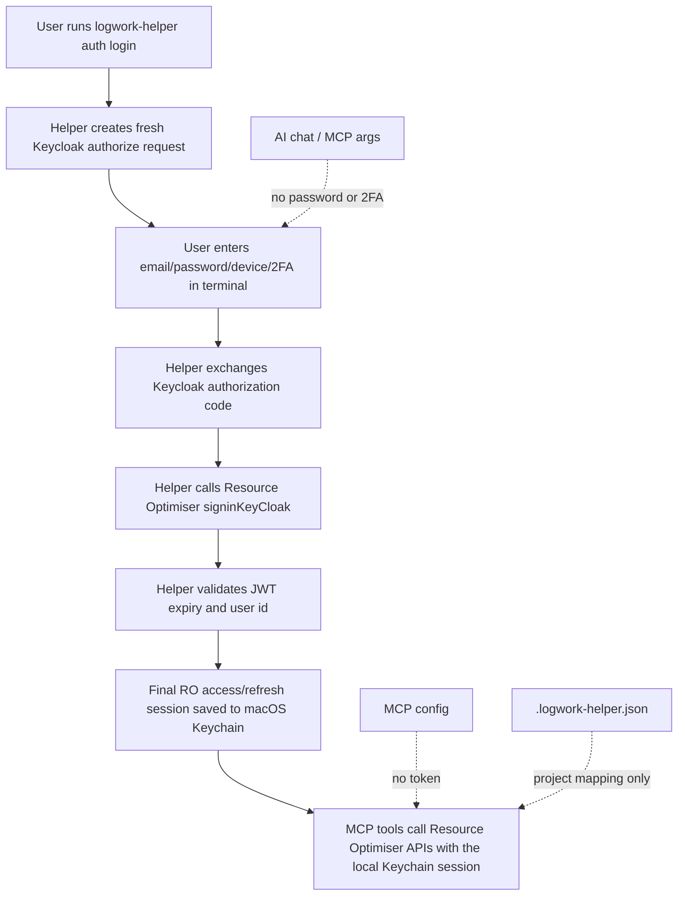

# Security And Auth

Logwork Helper does not accept or store Bearer tokens in config files. Login is API-only and runs in Terminal.

## Auth Setup

Start login:

```bash
logwork-helper auth login
```

What happens:

1. The helper creates a fresh Keycloak authorization request.
2. You enter Resource Optimiser email and password in Terminal.
3. You choose the 2FA device in Terminal.
4. You enter the 2FA code in Terminal.
5. The helper exchanges the Keycloak authorization code.
6. The helper calls Resource Optimiser `signinKeyCloak`.
7. The helper stores the Resource Optimiser access/refresh token session in macOS Keychain.

Check auth status without printing the token:

```bash
logwork-helper auth status
```

Delete the stored token:

```bash
logwork-helper auth logout
```

## Auth Notes

- Password and 2FA are never accepted through MCP tool inputs or AI chat.
- Password and 2FA are never stored.
- Keycloak URLs contain dynamic `state`, `nonce`, `execution`, and `tab_id` values. Do not hardcode or paste them into config.
- Keycloak access tokens are intermediate only and are not stored.
- Only the final Resource Optimiser access/refresh token session is stored in macOS Keychain.
- Auth does not open or read any browser profile.

## Auth Security Flow



## Stored Files

Installed runtime:

```text
~/.logwork-helper
```

Project mapping config:

```text
~/.logwork-helper/.logwork-helper.json
```

Manual drafts:

```text
~/.logwork-helper/manual-drafts.json
```

Diagnostics reports:

```text
~/.logwork-helper/diagnostics
```

## Safety Model

- Token is not stored in MCP config.
- Token is not stored in `.logwork-helper.json`.
- Email may be remembered in macOS Keychain to prefill the next login.
- MCP writes logwork only after an assistant calls `apply_logwork_batch` with explicit confirmation and a cached preview `batchId`.
- `query_logwork` and `list_logwork_projects` are read-only.
- Diagnostics reports redact tokens, cookies, passwords, OTPs, auth codes, and raw HTML.
