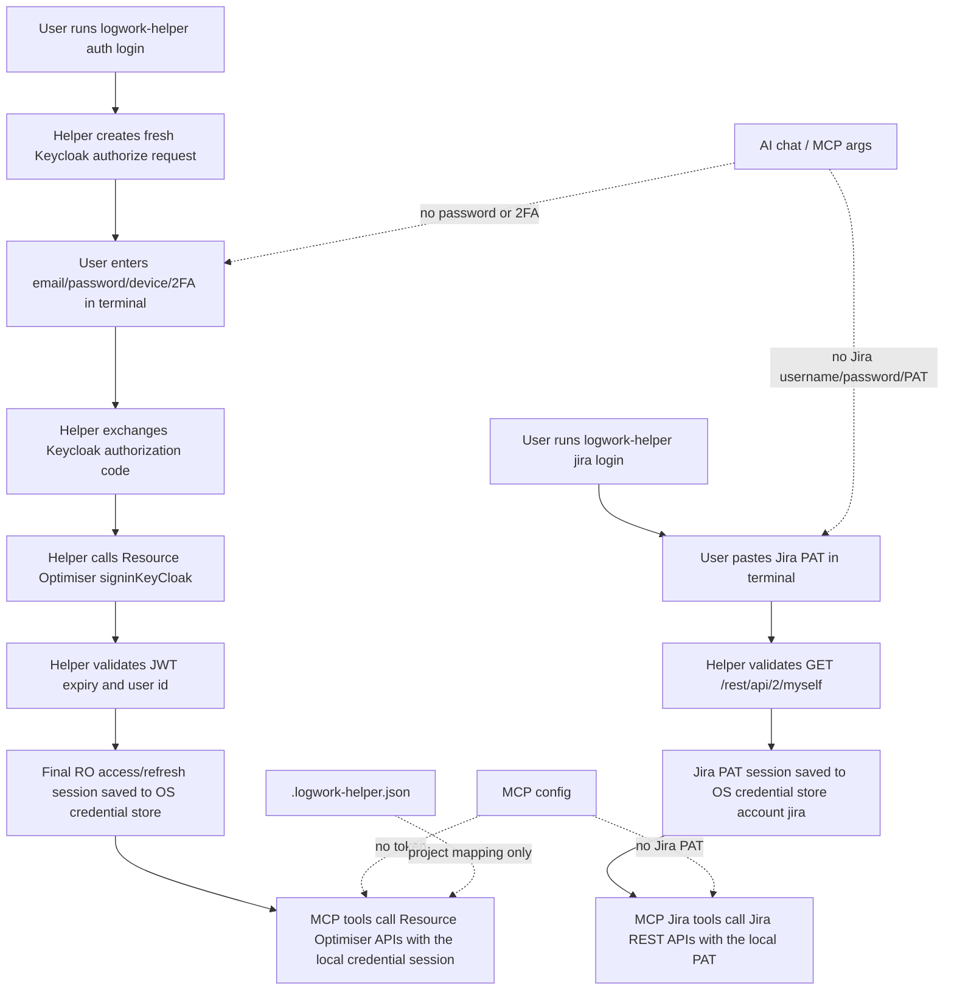

# Security And Auth

Logwork Helper does not accept or store Bearer tokens in config files. Resource Optimiser login and Jira PAT login both run in Terminal.

## Auth Setup

Start login:

```bash
logwork-helper auth login
```

What happens:

1. The helper creates a fresh Keycloak authorization request.
2. You enter Resource Optimiser email and password in Terminal.
3. You choose the 2FA device in Terminal.
4. You enter the 2FA code in Terminal.
5. The helper exchanges the Keycloak authorization code.
6. The helper calls Resource Optimiser `signinKeyCloak`.
7. The helper stores the Resource Optimiser access/refresh token session in the OS credential store.

Check auth status without printing the token:

```bash
logwork-helper auth status
```

Delete the stored token:

```bash
logwork-helper auth logout
```

## Auth Notes

- Password and 2FA are never accepted through MCP tool inputs or AI chat.
- Password and 2FA are never stored.
- Keycloak URLs contain dynamic `state`, `nonce`, `execution`, and `tab_id` values. Do not hardcode or paste them into config.
- Keycloak access tokens are intermediate only and are not stored.
- Only the final Resource Optimiser access/refresh token session is stored in the OS credential store: macOS Keychain on macOS, or Windows Credential Manager on Windows.
- Auth does not open or read any browser profile.

## Jira PAT Setup

Jira self-hosted worklogs use a Jira Personal Access Token. The default Jira base URL is:

```text
https://jira-vnv.vinova.sg
```

Start Jira auth:

```bash
logwork-helper jira login
```

Use a different Jira URL only when needed:

```bash
logwork-helper jira login --base-url https://jira.example.com
```

What happens:

1. You paste the Jira Personal Access Token in Terminal.
2. The helper validates the token with `GET /rest/api/2/myself`.
3. The helper stores `{ baseUrl, token, user }` in the OS credential store under service `logwork-helper`, account `jira`.

Check or delete Jira auth without printing the token:

```bash
logwork-helper jira status
logwork-helper jira logout
```

Jira username/password login is not supported in MCP. Do not paste Jira passwords, PATs, cookies, or raw Jira auth logs into AI chat.

## Auth Security Flow


```mermaid
flowchart TD
  A["User runs logwork-helper auth login"] --> B["Helper creates fresh Keycloak authorize request"]
  B --> C["User enters email/password/device/2FA in terminal"]
  C --> D["Helper exchanges Keycloak authorization code"]
  D --> E["Helper calls Resource Optimiser signinKeyCloak"]
  E --> F["Helper validates JWT expiry and user id"]
  F --> G["Final RO access/refresh session saved to OS credential store"]
  G --> H["MCP tools call Resource Optimiser APIs with the local credential session"]
  L["User runs logwork-helper jira login"] --> M["User pastes Jira PAT in terminal"]
  M --> N["Helper validates GET /rest/api/2/myself"]
  N --> O["Jira PAT session saved to OS credential store account jira"]
  O --> P["MCP Jira tools call Jira REST APIs with the local PAT"]

  I["MCP config"] -. "no token" .-> H
  I -. "no Jira PAT" .-> P
  J[".logwork-helper.json"] -. "project mapping only" .-> H
  K["AI chat / MCP args"] -. "no password or 2FA" .-> C
  K -. "no Jira username/password/PAT" .-> M
```

## Stored Files

Installed runtime:

```text
~/.logwork-helper
```

On Windows this is under:

```text
%USERPROFILE%\.logwork-helper
```

Project mapping config:

```text
~/.logwork-helper/.logwork-helper.json
```

Manual drafts:

```text
~/.logwork-helper/manual-drafts.json
```

Diagnostics reports:

```text
~/.logwork-helper/diagnostics
```

## Safety Model

- Token is not stored in MCP config.
- Token is not stored in `.logwork-helper.json`.
- Email may be remembered in the OS credential store to prefill the next login.
- MCP writes logwork only after an assistant calls `apply_logwork_batch` with explicit confirmation and a cached preview `batchId`.
- MCP writes Jira worklogs only after an assistant calls `apply_jira_worklog_batch` with explicit confirmation and a cached Jira preview `batchId`.
- Resource Optimiser apply and Jira worklog apply are separate flows. Applying Resource Optimiser logwork does not automatically write Jira worklogs.
- Jira duplicate detection is blocking and has no override option in v1.
- `query_logwork` and `list_logwork_projects` are read-only.
- Diagnostics reports redact tokens, cookies, passwords, OTPs, auth codes, and raw HTML.
