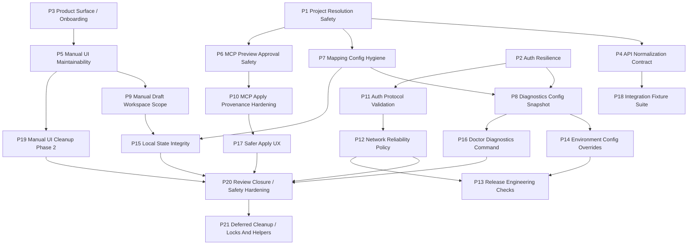

# Pitch Timeline

## Ordered Execution

1. [[pitches/P1-project-resolution-safety|P1 Project Resolution Safety]]
2. [[pitches/P2-auth-resilience|P2 Auth Resilience]]
3. [[pitches/P3-product-surface-onboarding|P3 Product Surface / Onboarding]]
4. [[pitches/P4-api-normalization-contract|P4 API Normalization Contract]]
5. [[pitches/P5-manual-ui-maintainability|P5 Manual UI Maintainability]]
6. [[pitches/P6-mcp-preview-approval-safety|P6 MCP Preview Approval Safety]]
7. [[pitches/P7-project-mapping-config-hygiene|P7 Project Mapping Config Hygiene]]
8. [[pitches/P8-diagnostics-config-snapshot|P8 Diagnostics Config Snapshot]]
9. [[pitches/P9-manual-draft-workspace-scope|P9 Manual Draft Workspace Scope]]
10. [[pitches/P10-mcp-apply-provenance-hardening|P10 MCP Apply Provenance Hardening]]
11. [[pitches/P11-auth-protocol-validation|P11 Auth Protocol Validation]]
12. [[pitches/P12-network-reliability-policy|P12 Network Reliability Policy]]
13. [[pitches/P13-release-engineering-checks|P13 Release Engineering Checks]]
14. [[pitches/P14-environment-config-overrides|P14 Environment Config Overrides]]
15. [[pitches/P15-local-state-integrity|P15 Local State Integrity]]
16. [[pitches/P16-doctor-diagnostics-command|P16 Doctor Diagnostics Command]]
17. [[pitches/P17-safer-apply-ux|P17 Safer Apply UX]]
18. [[pitches/P18-integration-fixture-suite|P18 Integration Fixture Suite]]
19. [[pitches/P19-manual-ui-cleanup-phase-2|P19 Manual UI Cleanup Phase 2]]
20. [[pitches/P20-review-closure-safety-hardening|P20 Review Closure / Safety Hardening]]
21. [[pitches/P21-deferred-cleanup-locks-and-helpers|P21 Deferred Cleanup / Locks And Helpers]] implemented, pending commit

## Dependency Notes

- P1 made preview resolution safer, which became the baseline for P6 and P7.
- P2 made auth failures safer, which made P8 diagnostics more useful.
- P3 clarified onboarding before the manual UI was refactored in P5.
- P5 made the manual UI easier to change, enabling the focused P9 draft-scope hardening.
- P6 made preview cache safer; P10 made MCP apply require cached provenance.
- P11 and P12 moved auth/network behavior closer to production-grade failure handling.
- P13 made release checks repeatable after the safety and reliability hardening.
- P14, P15, and P16 improved operational supportability.
- P17 made write approval easier to review before apply.
- P18 added fixture-based API contract coverage.
- P19 continued manual UI maintainability after the manual REPL direction was clearer.
- P20 closed the final release-review safety pass across approval immutability, duplicate apply prevention, HTTPS/origin rules, diagnostics privacy, retry hygiene, normalization fallback, and test env isolation.
- P21 handled the prioritized P20 deferred cleanup: per-file config/draft locks, shared project identity and list navigation helpers, and explicit normalization result APIs with backward compatibility.
